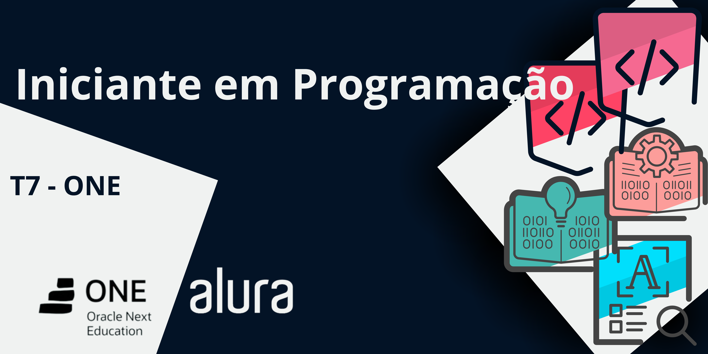

<h1 align="center">

</h1>

## Descrição
Este repositório é destinado a armazenar meus projetos do curso iniciante em programação, que abrange os seguintes temas:

- Lógica de Programação
- HTML e CSS
- Otimizando Resultados com ChatGPT
- Git e GitHub
- Desafio Final para fixação dos conhecimentos obtidos no curso

## Atalhos
Aqui estão os links diretos para acessar os repositórios de cada curso individualmente:
- **Lógica de Programação**: <a href="https://github.com/SergioSinhoca/"
title="View repository">Acesse o repositório</a> 

- **HTML e CSS**: <a href="https://github.com/SergioSinhoca/"
title="View repository">Acesse o repositório</a>

- **Desafio Final**: <a href="https://github.com/SergioSinhoca/"
title="View repository">Acesse o repositório</a>

## Links Úteis
Este curso faz parte do programa `Oracle Next Education` em parceria com a `Alura`. Para saber mais sobre o programa, acesse o link abaixo:

- [Oracle Next Education](https://www.oracle.com/br/education/oracle-next-education/)

 > ℹ️ **NOTE:** As imagens utilizadas nos README foram retiradas do site da Alura. Todos os direitos são reservados à Alura. Para saber mais, acesse o link abaixo: 

- [Alura](https://www.alura.com.br/)

