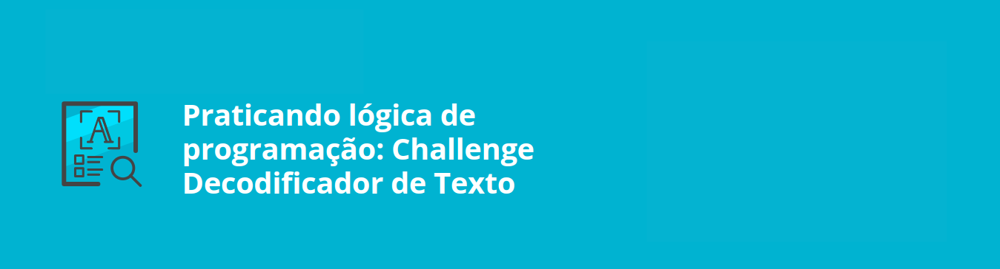

# Desafio Encriptador de Texto

## Descrição
O projeto "desafio encriptador de texto" tem como objetivo principal aplicar os conhecimentos teóricos adquiridos nos cursos anteriores, em um contexto prático. Através da criação de um programa que criptografa e descriptografa mensagens.

## Tecnologias utilizadas

## Demostração do projeto 

