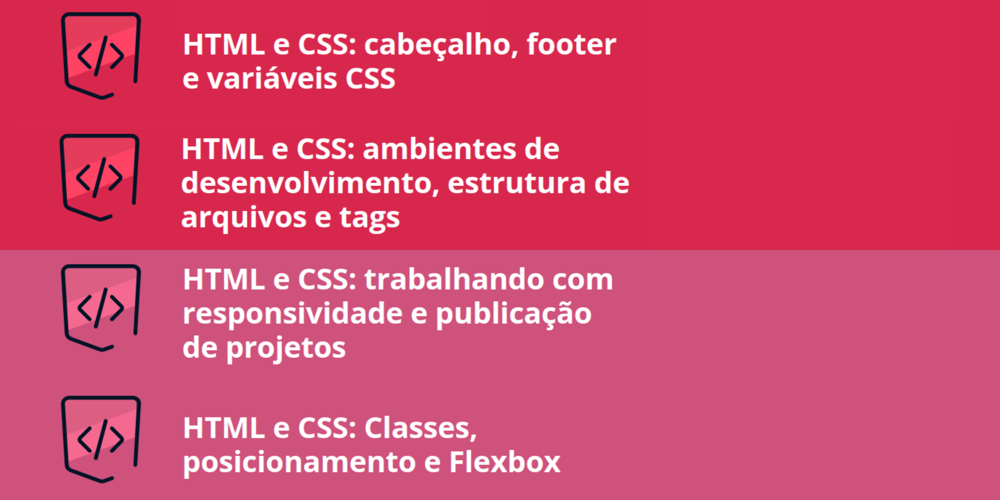

# Curso HTML e CSS

## Descrição
Neste repositório, armazenarei meu projeto desenvolvido ao longo dos quatro cursos de HTML e CSS. Cada curso contribuiu com diferentes conhecimentos e habilidades que foram integrados neste projeto final. O projeto é o desenvolvimento do meu portfólio pessoal. Abaixo, estão os cursos e seus principais tópicos:

- HTML e CSS: Ambientes de Desenvolvimento, Estrutura de Arquivos e Tags

  - Configuração do ambiente de desenvolvimento
  - Estrutura de arquivos HTML e CSS
  - Uso das principais tags HTML

- HTML e CSS: Classes, Posicionamento e Flexbox

  - Utilização de classes CSS
  - Técnicas de posicionamento de elementos
  - Implementação do Flexbox para layouts responsivos

- HTML e CSS: Cabeçalho, Footer e Variáveis CSS

  - Estruturação de cabeçalhos e rodapés
  - Uso de variáveis CSS para estilização consistente
  - Design modular e reutilizável
  
- HTML e CSS: Trabalhando com Responsividade e Publicação de Projetos

  - Técnicas de design responsivo
  - Media queries para diferentes dispositivos
  - Publicação de projetos web

## Projeto Final
Para acessar o projeto desenvolvido durante as aulas de HTML e CSS, clique no repositório abaixo.

<a href="https://github.com/SergioSinhoca/"
title="View repository">Projeto portfólio</a>