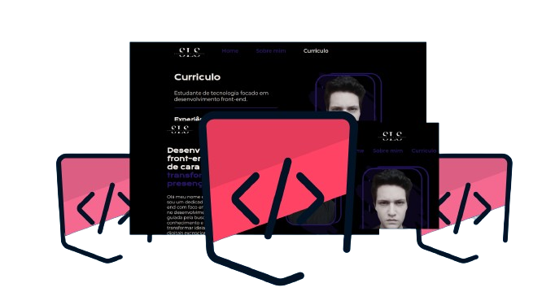

# Portfólio pessoal

## Descrição
Neste projeto, aplicarei os conhecimentos adquiridos em cada um dos cursos de HTML e CSS, criando um portfólio pessoal, estilizado e responsivo, pronto para ser publicado na web.

## Tecnologias utilizadas

## Demostração do projeto 

