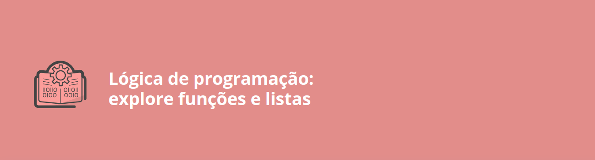

# Segundo módulo curso de lógica

## Descrição 
Este módulo visa aprofundar os conhecimentos em lógica de programação, focando em funções e listas com JavaScript. Além disso, explora HTML e CSS, permitindo a criação e manipulação de funções, o trabalho com listas e a publicação de projetos na web. Para consolidar o aprendizado, são propostos exercícios e desafios práticos, para desenvolver projetos mais complexos.

## Estrutura do Curso
- Interagindo com HTML
    - Apresentação
    - Preparando o ambiente
    - Manipulando textos
    - Criando uma função
    - Manipulando conteúdo HTML com JavaScript
    - Para saber mais: diferenças entre HTML, CSS e JS
    - Desafio: hora da prática
    - O que aprendemos?

- Funções
    - Projeto da aula anterior
    - Funções com parâmetros
    - Funções com retorno
    - Tipo booleano
    - Anatomia de uma função
    - Função que verifica números
    - Para saber mais: funções com JavaScript
    - Desafio: hora da prática
    - O que aprendemos?
        
- Reiniciando o Jogo
    - Projeto da aula anterior
    - Verificando o chute
    - Contando tentativas
    - Botão reiniciar
    - Reiniciando o Jogo
    - Calculadora de Média e Situação do Aluno
    - Desafio: hora da prática
    - O que aprendemos?

- Listas
    - Projeto da aula anterior
    - Documentação sobre listas
    - Implementando a lista
    - Limitando os números sorteados
    - Manipulação de Listas em JavaScript
    - Para saber mais: vamos ler mais sobre listas?
    - Desafio: hora da prática
    - O que aprendemos?
    
- Publicando o Projeto
    - Projeto da aula anterior
    - Speech
    - GitHub
    - Para saber mais: criando conta no GitHub e    Vercel (passo a passo)
    - Projeto final do curso
    - Parabéns
    - Carreira em programação
    - Conclusão
    - Referências
    - Créditos

## Atalhos 
O repositório com os exercícios e desafios propostos no curso está disponível abaixo.

- Projeto do curso
    - <a href="https://github.com/SergioSinhoca/iniciante-programacao-next-education/tree/main/logica-programacao/Lógica%20de%20programação%3A%20explore%20funções%20e%20listas/js-curso-2-aula1"
    title="View repository">Jogo número segreto</a>

- Exercícios
   - <a href="https://github.com/SergioSinhoca/iniciante-programacao-next-education/tree/main/logica-programacao/Lógica%20de%20programação%3A%20explore%20funções%20e%20listas/exercícios-01"
   title="View repository">1° Lista de exercícios</a>

   - <a href="https://github.com/SergioSinhoca/iniciante-programacao-next-education/tree/main/logica-programacao/Lógica%20de%20programação%3A%20explore%20funções%20e%20listas/exercícios-02"
   title="View repository">2° Lista de exercícios</a>

   - <a href="https://github.com/SergioSinhoca/iniciante-programacao-next-education/tree/main/logica-programacao/Lógica%20de%20programação%3A%20explore%20funções%20e%20listas/exercícios-03"
   title="View repository">3° Lista de exercícios</a>

   - <a href="https://github.com/SergioSinhoca/iniciante-programacao-next-education/tree/main/logica-programacao/Lógica%20de%20programação%3A%20explore%20funções%20e%20listas/js-curso-2-desafio_1"
   title="View repository">4° Lista de exercícios</a>

