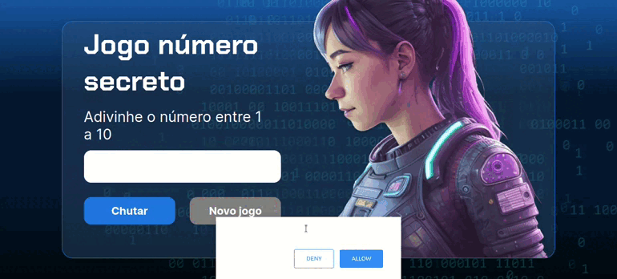

# Projeto Jogo número secreto

## Descrição
Neste projeto desenvolvido durante a aula 'Lógica de Programação: Explore Funções e Listas', foram acrescentados upgrades no projeto do número secreto. As melhorias incluem:

- **Uma interface gráfica**: Em vez de usar apenas o alert para mostrar as mensagens, vamos criar uma interface visual com botões, campos de texto e outros elementos para tornar a experiência do usuário mais interativa.

- **Novas funcionalidades**: Vamos implementar novas funcionalidades para o jogo, como a possibilidade de escolher o nível de dificuldade, definir um limite de tentativas e até mesmo dar dicas ao jogador.

- **Um visual mais atraente**: Vamos usar CSS para deixar a interface do nosso jogo mais bonita e organizada, com cores, fontes e estilos que combinem com o tema do jogo.

- **Texto para fala**: Vamos integrar a biblioteca ResponsiveVoice.js para converter texto em fala dentro da página, proporcionando uma experiência mais acessível e dinâmica. 

## Tecnologias utilizadas

## Demostração do projeto 

