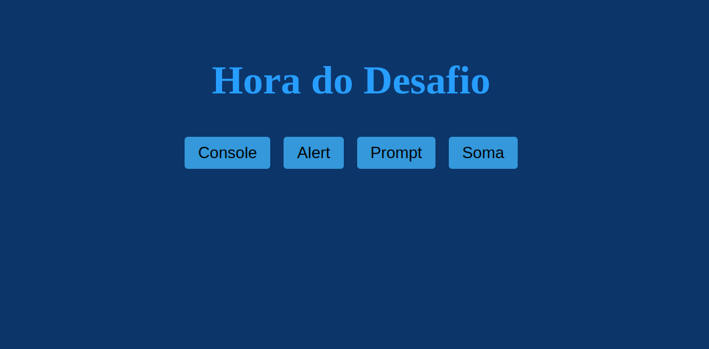
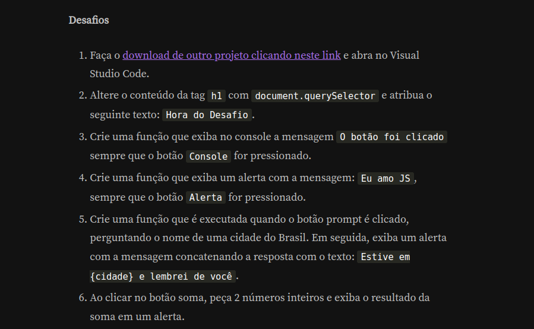
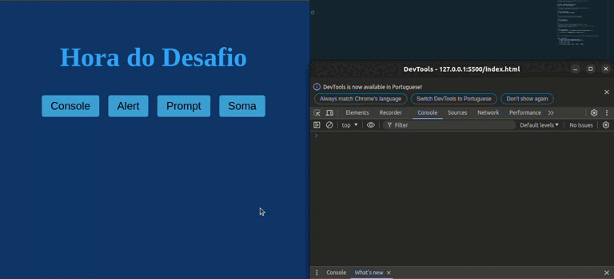

# Quarta Lista de exercícios

## Descrição 
Repositório contendo os conteúdos da quarta lista de exercícios, curso Lógica de programação explore funções e listas.

## Exercícios 

## Resolução dos exercícios  

