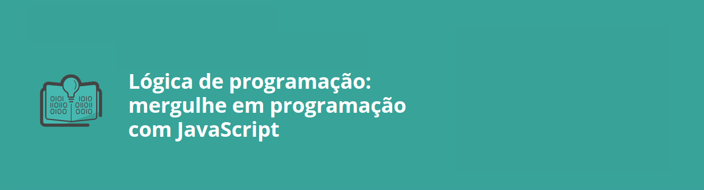

# Primeiro módulo curso de lógica 

 
## Descrição
Este módulo tem como objetivo introduzir os fundamentos da programação utilizando JavaScript. o módulo apresenta desde a configuração do ambiente de desenvolvimento até a criação de estruturas condicionais, loops e boas práticas de programação. O curso é projetado para fornecer uma base sólida em JavaScript, integrando com HTML e CSS, e desenvolvendo um projeto para consolidar o aprendizado.

## Estrutura do curso 
- Iniciando com JavaScript
   - Apresentação
   - Preparando o ambiente
   - Carregando o projeto base
   - Exibindo mensagens na tela
   - Comparando variáveis
   - Alert e prompt
   - Alterando o valor das variáveis
   - Onde está o bug?
   - Desafio: hora da prática
   - Para saber mais: documentação
   - O que aprendemos?
    
- Condicionais e Concatenação
   - Projeto da aula anterior
   - Else e comentários
   - Concatenação
   - Live server
   - Alterando a mensagem do alert
   - Detran
   - Trabalhando com condicionais
   - Faça como eu fiz: console.log
   - Desafio: hora da prática
   - Para saber mais: ponto e vírgula no JavaScript
   - O que aprendemos?

- Loops e Tentativas
   - Projeto da aula anterior
   - Novas condições
   - Enquanto...
   - Tentativas
   - Contador 1
   - Loop infinito
   - Desafio: hora da prática
   - Para saber mais: operadores lógicos
   - O que aprendemos?

- Boas Práticas de Programação
   - Projeto da aula anterior
   - Break
   - Operador ternário
   - Math random
   - Número aleatório
   - Operador ternário
   - Desafio: hora da prática
   - Para saber mais: preciso decorar cada linha de código ou comando?
   - O que aprendemos?

- Desafio Final
   - Projeto da aula anterior
   - Apresentação do desafio
   - Resolvendo o desafio
   - Projeto final do curso
   - Referências
   - Conclusão
   - Parabéns!

## Atalhos 
Clique <a href="https://github.com/SergioSinhoca/iniciante-programacao-next-education/tree/main/logica-programacao/Lógica%20de%20programação%3A%20mergulhe%20em%20programação%20com%20JavaScript/logica-js-projeto_inicial"
 title="View repository"> aqui </a>
 para acessar o repositório com a resolução do `desafio final`
