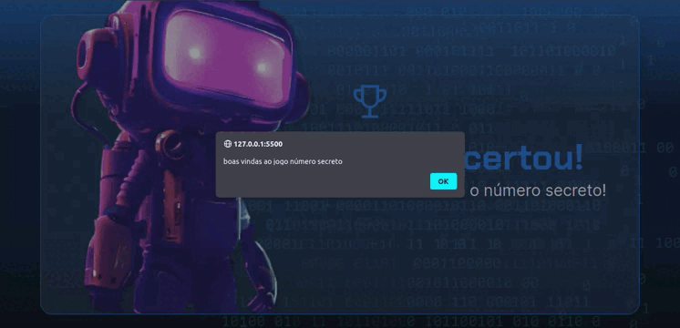

# Desafio Jogo do Número Secreto

## Descrição
O desafio proposto ao longo desse curso é desenvolver um jogo chamado "Jogo do Número Secreto".

Nesse jogo, o sistema irá gerar um número aleatório, e o usuário, terá que adivinhar qual é esse número. Para isso, você irá inserir alguns números e o sistema te dará dicas, como "o número secreto é maior" ou "o número secreto é menor".

Confira as melhorias do projeto no curso <a href="https://github.com/SergioSinhoca/iniciante-programacao-next-education/tree/main/logica-programacao/Lógica%20de%20programação%3A%20explore%20funções%20e%20listas"
 title="View repository"> Lógica de programação: explore funções e listas </a>

## Tecnologias utilizadas

## Demostração do projeto 

