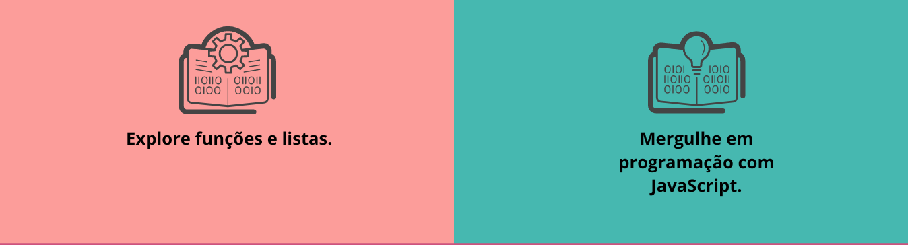

# Curso Lógica de Programação

## Descrição
Este repositório contém os materiais dos cursos Lógica de programação. O curso oferece uma introdução abrangente à programação com JavaScript, cobrindo desde os conceitos básicos até tópicos mais avançados.

## Estrutura do curso 
- Lógica de programação: mergulhe em programação com JavaScript
    - Exiba mensagens na tela de forma interativa
    - Utilize variáveis no desenvolvimento de software
    - Ingresse no mundo de desenvolvimento seguindo boas práticas  de programação
    - Desenvolva uma aplicação do início ao fim, inspirada no mundo real
    - Aprenda a adaptar soluções desenvolvidas pela linguagem em seus programas de software

 - Lógica de programação: explore funções e listas
    - Aprenda o que são funções e como usar o JavaScript para manipular elementos na tela
    - Desenvolva ainda mais sua lógica de programação inspirado num projeto real
    - Saiba como usar o Github e Vercel para publicar seus projetos
    - Descubra como utilizar listas, uma das principais estruturas de dados no mundo da programação
    - Crie manipulações de palavras e números de forma dinâmica com JavaScript 

## Atalhos 
Clique <a href="https://github.com/SergioSinhoca/"
 title="View repository"> aqui </a>
 para acessar o repositório `Lógica de programação: mergulhe em programação com JavaScript`

 Clique <a href="https://github.com/SergioSinhoca/"
 title="View repository"> aqui </a>
 para acessar o repositório `Lógica de programação: explore funções e listas`

 
